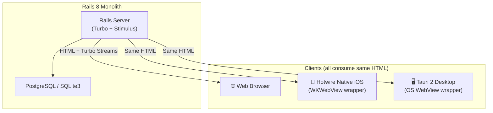

# Media Inventory App with Hotwire & Native Client Support

Welcome to the **Media Inventory Application**, a modern Ruby on Rails 8.1 web platform designed to catalog personal media collections. The application features a premium dark-slate aesthetic, modular database entities, and supports three clients (Web, iOS, and Desktop) consuming the same HTML monolith.

---

## 🚀 Key Features

*   **Aesthetic Dark Makeover:** Premium dark-slate theme (`#0b0f19`) featuring:
    *   Google Fonts integration (**Outfit** for headings, **Plus Jakarta Sans** for body/UI).
    *   Glassmorphic navbar and card containers with frosted border transitions.
    *   Responsive card grids for catalog items utilizing category-specific emojis (🎬, 💿, 📚, 📺, 🤼).
    *   **Stretched Links Pattern:** CSS overlays that expand click targets across the entire card boundary while preserving standard Rails anchors for test compatibility.
*   **Modern Hotwire Stack:** Migrated from legacy jQuery/Turbolinks to Rails 8 defaults:
    *   **Turbo Drive & Morphing:** Smooth, instantaneous page transitions with Turbo 8 morphing.
    *   **Turbo Frames & Streams:** Inline pagination and real-time updates for resource creation and lists.
    *   **Stimulus JS:** Modular controllers replacing legacy jQuery handlers, including an interactive iTunes/Google Books cover art thumbnail fetcher.
*   **Hotwire Native iOS App:** A native iOS WKWebView wrapper using the `hotwire-native-ios` SDK. Supports native tab bars, page transitions, and native bridge components.
*   **Tauri 2 Desktop App:** A cross-platform desktop application wrapper targeting macOS, Windows, and Linux. Built with Rust and Tauri 2.
*   **Flexible Database Support:** Dynamically routes to PostgreSQL when run inside Docker containers, and falls back to SQLite3 for simple local host execution.

---

## 📐 Architecture & Client Flow



---

## 📁 Repository Directory Structure

*   `app/`, `config/`, `db/`, `lib/`, `spec/` — Monolithic Rails application files.
*   `native/ios/` — Hotwire Native iOS wrapper project (Swift Package Manager).
*   `native/desktop/` — Tauri 2 desktop app wrapper (Rust + Node CLI).
*   `Dockerfile` — Multi-stage production container build.
*   `docker-compose.yml` — Container configuration for local PostgreSQL + Rails development.
*   `docker-compose.production.yml` — Production environment container configuration.

---

## 🛠️ Getting Started (Local Host Development)

By default, running locally on your host machine will use **SQLite3** for simplicity.

### Prerequisites

*   **Ruby:** Version `3.2.3` (defined in `.ruby-version` and `Gemfile`).
*   **Node.js & npm** (only required for Tauri desktop client).

### Setup and Running

1.  **Clone the Repository and Install Gems:**
    ```bash
    cd media_inventory
    bundle install
    ```
2.  **Run Database Migrations & Seed Content:**
    ```bash
    bundle exec rails db:migrate
    bundle exec rails db:seed
    ```
    *(Clears existing records and generates demo users and 31 media items).*
3.  **Build Assets:**
    ```bash
    bin/rails dartsass:build
    ```
4.  **Start the Rails Server:**
    ```bash
    bin/rails s
    ```
5.  **Open the Application:**
    Navigate to [http://localhost:3000](http://localhost:3000) in your browser.

---

## 🐳 Running with Docker (PostgreSQL)

To run the entire stack containerized using **PostgreSQL**:

1.  **Start the Container Stack:**
    ```bash
    docker compose up --build
    ```
    *(Pulls/builds Postgres 17 and the Rails 8 application, then starts the server on port 3000).*
2.  **Open the Application:**
    Navigate to [http://localhost:3000](http://localhost:3000).

---

## 📱 Running the iOS App (Xcode)

1.  Ensure you have **Xcode 16+** installed.
2.  Open `/native/ios/MediaInventory/Package.swift` in Xcode.
3.  Choose a Simulator target (e.g., iPhone 16 running iOS 18+).
4.  Click **Run** to launch the wrapper, which will load `http://localhost:3000` (for development).

---

## 🖥️ Running the Desktop App (Tauri 2)

### Prerequisites
*   Install **Rust** via [rustup](https://rustup.rs).
*   For Windows/Linux platform prerequisites, see [Tauri Prerequisites](https://v2.tauri.app/start/prerequisites/).

### Setup and Running

1.  **Navigate to the Desktop folder and install dependencies:**
    ```bash
    cd native/desktop
    npm install
    ```
2.  **Generate application icons (optional — already generated):**
    ```bash
    npx tauri icon app-icon.png
    ```
3.  **Run the Tauri app in development mode:**
    Make sure your Rails server is running on `localhost:3000` first, then run:
    ```bash
    npm run dev
    ```
4.  **Build a production release binary:**
    ```bash
    npm run build
    ```

---

## 🧪 Testing & Quality Assurance

*   **RSpec Test Suite:** Includes request and system specs covering all views, paginated resources, controller actions, and security headers.
    ```bash
    bundle exec rspec
    ```
*   **Linter Checks:** Run RuboCop static analysis checks to verify code style:
    ```bash
    bundle exec rubocop
    ```