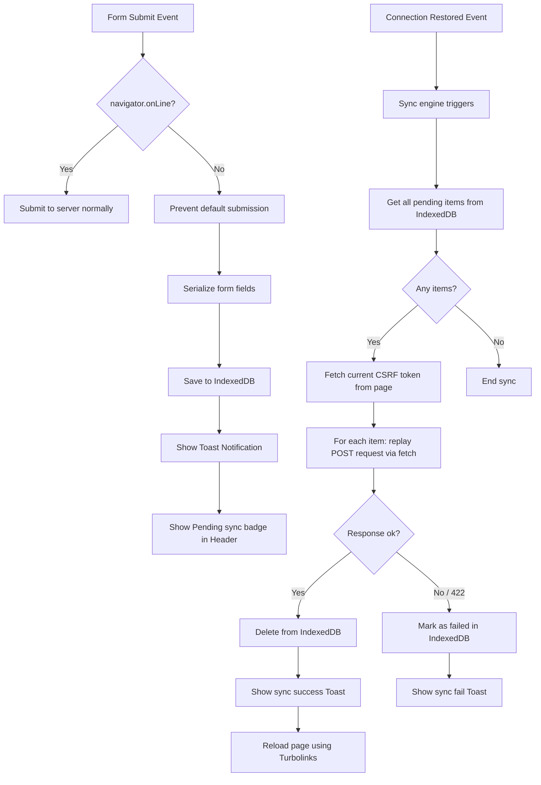

# Media Inventory App with PWA Offline Sync

Welcome to the **Media Inventory Application**, a Ruby on Rails 8.1 web platform designed to catalog personal media collections. The application features a premium dark-slate aesthetic, modular database entities, and a robust Progressive Web App (PWA) offline sync engine.

---

## 🚀 Key Features

*   **Aesthetic Dark Makeover:** Premium dark-slate theme (`#0b0f19`) featuring:
    *   Google Fonts integration (**Outfit** for headings, **Plus Jakarta Sans** for body/UI).
    *   Glassmorphic navbar and card containers with frosted border transitions.
    *   Responsive card grids for catalog items utilizing category-specific emojis (🎬, 💿, 📚, 📺, 🤼).
    *   **Stretched Links Pattern:** CSS overlays that expand click targets across the entire card boundary while preserving standard Rails anchors for test compatibility.
*   **PWA Offline Mode & Background Sync:** Intercepts resource creation forms when the network is unavailable:
    *   **IndexedDB Queue:** Client-side asynchronous storage database (`MediaInventoryOfflineDB`) to hold pending creations.
    *   **Service Worker Caching:** Caches static files (Cache-First) and HTML routes (Network-First) so forms remain accessible offline.
    *   **Auto Sync Engine:** Monitors the connection status (`online`/`offline` window hooks) and automatically replay submissions with the latest page CSRF token when connection returns.
    *   **Dynamic UI Indicators:** Floating yellow/green offline banners, toaster notifications, and a collapsible pending synchronizations list panel.
    *   **Offline Fallback Page:** A beautiful, responsive fallback page (`offline.html`) served when navigating to uncached pages while offline.
*   **Real-World Seed Data:** Seeding script with a curated list of 31 masterpieces across 5 media types associated with public, confirmed profiles.

---

## 📐 Architecture & Offline Flow



---

## 🛠️ Getting Started

### Prerequisites

*   **Ruby:** Version `3.2.3` (defined in `.ruby-version` and `Gemfile`).
*   **Databases:** SQLite3 (development/testing) and PostgreSQL (production).

### Setup and Running

1.  **Clone the Repository and Navigate to the Directory:**
    ```bash
    cd media_inventory
    ```
2.  **Install Gem Dependencies:**
    ```bash
    bundle install
    ```
3.  **Run Database Migrations:**
    ```bash
    bundle exec rails db:migrate
    ```
4.  **Seed the Database with Real-World Demo Content:**
    ```bash
    bundle exec rails db:seed
    ```
    *(Clears existing records and generates 2 default users and 31 media items).*
5.  **Start the Rails Server:**
    ```bash
    bin/rails s
    ```
6.  **Open the Application:**
    Navigate to [http://localhost:3000](http://localhost:3000) in your browser.

---

## 🧪 Testing & Quality Assurance

*   **RSpec Test Suite:** Includes request and system specs covering pagination, resource creation, security headers, and PWA static routing assets.
    ```bash
    bundle exec rspec
    ```
*   **Linter Checks:** Run RuboCop static analysis checks to verify code style and quality:
    ```bash
    bundle exec rubocop
    ```

---

## 🔌 Verifying Offline Synchronization

1.  Log in to the application and navigate to **New Movie** (`/movies/new`).
2.  Open Chrome DevTools (`F12`), switch to the **Network** tab, and toggle the throttling dropdown to **Offline**.
3.  Fill in the movie details (e.g., *Inception*) and press **Create Movie**.
    *   **Expectation:** The submission is blocked. A warning toast slide-in states: *"Saved Offline | 'Inception' has been saved locally"*. A yellow badge displaying `"1 pending"` appears in the navbar.
4.  Click the `"1 pending"` badge.
    *   **Expectation:** A bottom-right drawer slides out listing the pending movie details and time.
5.  Go to DevTools **Application** -> **IndexedDB** -> **MediaInventoryOfflineDB** -> **pending_sync** to view the serialized payload.
6.  Toggle the DevTools Network throttling back to **Online**.
    *   **Expectation:** The floating top banner displays *"Syncing local database..."* and then *"Sync complete!"* (green). The movie is uploaded, deleted from IndexedDB, and the lists refresh automatically to reveal the new movie card.